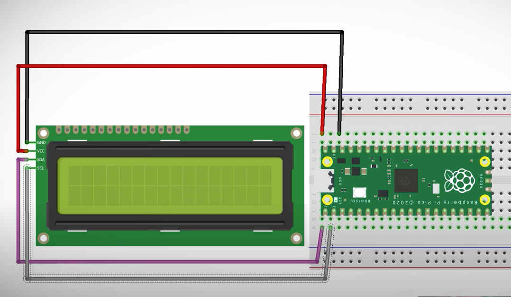

# LCD i2c and temperature

download library files, read the instructions from:

https://github.com/T-622/RPI-PICO-I2C-LCD

for reference this is the connection with the pico:

if you need to understand more about the temperature of the sensor of the pico please take a look into 
[temperature](./temperature.md)

code on `temperature_reader.py`